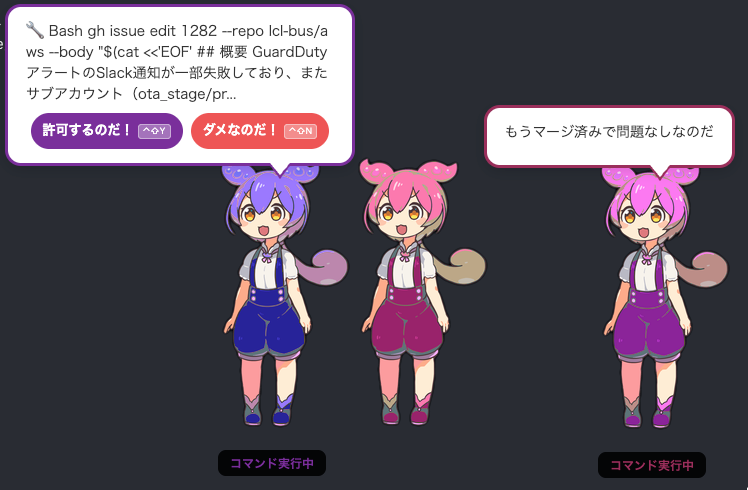

# ずんだもん通知 - Claude Code デスクトップ通知アプリ

Claude Code で作業中、PermissionRequest（許可確認）や入力待ちが発生してもターミナルを見ていないと気づけない問題を解決するデスクトップアプリです。

画面端にずんだもんが常駐し、Claude Code の hook 経由で通知や許可操作をデスクトップ上で完結させます。

## 動作イメージ



- 画面右下にずんだもんが常駐
- Claude Code が許可を求めると、ずんだもんが吹き出しで通知
- 「許可するのだ！」「ダメなのだ！」ボタンで操作
- ずんだもんをドラッグして好きな位置に移動可能
- ずんだもんを右クリックでメニュー表示（吹き出しを消す・再起動・このずんだもんを終了・終了）
- グローバルショートカットで他のアプリがアクティブでも許可/拒否可能
- マルチエージェント実行時も複数の Permission リクエストをキューで管理し順次表示
- **複数 Claude Code セッション対応**: セッションごとに独立したずんだもんウィンドウを表示、色で識別
- **codex CLI 連携（オプション）**: codex CLI がインストールされている場合、以下の追加機能が有効になります
  - **入力待ち要約**: Claude Code が入力待ちになった時、最後の出力をずんだもん口調で30文字以内に要約して吹き出し表示
  - **Permission 自動リスク判定**: codex にコマンドのリスクを判定させ、安全なコマンド（ファイル読み取り、git status 等）を自動許可。RISK 判定時は吹き出しにリスク理由を表示。自動許可時は「✅ コマンドの概要」を吹き出しで簡易表示（設定で有効化が必要、[詳細](#自動リスク判定permission-自動許可)）

## 必要なもの

- **Node.js** (v18 以上)
- **socat** (`brew install socat`)

## セットアップ

```bash
# 1. リポジトリをクローン
git clone <repo-url> ~/work/zundamon-notify
cd ~/work/zundamon-notify

# 2. 依存パッケージをインストール
npm install

# 3. socat をインストール（未インストールの場合）
brew install socat

# 4. (推奨) codex CLI をインストール
npm install -g @openai/codex
```

> **codex CLI のインストールを推奨します**: (1) Stop hook（入力待ち通知）で、Claude Code の最後の出力をずんだもん口調で30文字以内に要約して吹き出し表示します。(2) Permission の自動リスク判定・自動許可機能が利用可能になります（[設定が必要](#permission-自動許可の設定オプション)）。codex CLI がない場合、(1) は固定メッセージ「入力を待っているのだ！」のみ、(2) は無効になります。

### Claude Code hooks の設定

`~/.claude/settings.json` の `hooks` に以下を追加してください。

```json
{
  "hooks": {
    "PermissionRequest": [
      {
        "matcher": "*",
        "hooks": [
          {
            "type": "command",
            "command": "bash ~/work/zundamon-notify/hooks/zundamon-permission.sh"
          }
        ]
      }
    ],
    "Stop": [
      {
        "matcher": "*",
        "hooks": [
          {
            "type": "command",
            "command": "bash ~/work/zundamon-notify/hooks/zundamon-stop.sh"
          }
        ]
      }
    ],
    "Notification": [
      {
        "matcher": "*",
        "hooks": [
          {
            "type": "command",
            "command": "bash ~/work/zundamon-notify/hooks/zundamon-notify.sh"
          }
        ]
      }
    ],
    "UserPromptSubmit": [
      {
        "hooks": [
          {
            "type": "command",
            "command": "bash ~/work/zundamon-notify/hooks/zundamon-pre-dismiss.sh"
          }
        ]
      }
    ],
    "PreToolUse": [
      {
        "matcher": "*",
        "hooks": [
          {
            "type": "command",
            "command": "bash ~/work/zundamon-notify/hooks/zundamon-pre-dismiss.sh"
          }
        ]
      }
    ],
    "PostToolUse": [
      {
        "matcher": "*",
        "hooks": [
          {
            "type": "command",
            "command": "bash ~/work/zundamon-notify/hooks/zundamon-dismiss.sh"
          }
        ]
      }
    ],
    "SessionEnd": [
      {
        "hooks": [
          {
            "type": "command",
            "command": "bash ~/work/zundamon-notify/hooks/zundamon-session-end.sh"
          }
        ]
      }
    ]
  }
}
```

> 既存の hooks 設定がある場合は、`hooks` 配列にエントリを追加する形でマージしてください。

### Permission 自動許可の設定（オプション）

codex CLI を使って Permission リクエストのリスクを自動判定し、安全なコマンドを自動許可する機能を有効化できます。**デフォルトは無効**です。

```bash
# 1. codex CLI をインストール
npm install -g @openai/codex

# 2. 設定ファイルを作成
mkdir -p ~/.config/zundamon-notify
cat > ~/.config/zundamon-notify/config.json << 'EOF'
{
  "auto_approve": {
    "enabled": true,
    "custom_rules": [
      "gh コマンドによるGitHubのread系操作（gh issue list, gh pr view等）は常にSAFE",
      "npm test, npm run lint は常にSAFE"
    ]
  }
}
EOF
```

> **⚠️ リスクについて**: この機能は codex CLI（LLM）にリスク判定を委ねるため、**誤判定の可能性があります**。安全なコマンドが RISK と判定される（偽陽性）場合は従来通り手動確認になるだけで問題ありませんが、危険なコマンドが SAFE と判定される（偽陰性）場合はユーザー確認なしに実行されます。判定に迷う場合は RISK 側に倒す設計ですが、**本番環境や機密データを扱う作業では無効のままにすることを推奨します**。自動許可されたコマンドは `~/.config/zundamon-notify/auto-approve.log` に記録されるので、定期的に確認してください。

## 使い方

### サービスとして自動起動（推奨）

```bash
# インストール（LaunchAgent 登録 + ログイン時自動起動）
bash scripts/install.sh
```

インストール後はログイン時に自動起動します。手動でサービスを制御するには：

```bash
# サービスの状態確認
launchctl list | grep zundamon

# 手動で起動/停止
launchctl start com.zundamon.notify
launchctl stop com.zundamon.notify

# ログの確認
tail -f ~/Library/Logs/zundamon-notify/stdout.log

# アンインストール（サービス解除）
bash scripts/uninstall.sh
```

### 手動起動

```bash
cd ~/work/zundamon-notify
npm start
```

起動すると画面右下にずんだもんが表示されます。この状態で Claude Code を使うと：

| イベント | 動作 |
|---------|------|
| **PermissionRequest** | 吹き出しにツール名・コマンドを表示。「許可するのだ！」「ダメなのだ！」ボタンで応答。AskUserQuestion の場合は質問と選択肢を表示（ボタンなし、ターミナルで回答） |
| **Stop**（入力待ち） | codex CLI がある場合は最後の出力を30文字以内に要約して吹き出し表示（質問・確認事項は優先表示）、なければ「入力を待っているのだ！」（右クリックメニューで閉じる） |
| **Notification** | 通知メッセージを吹き出し表示（右クリックメニューで閉じる） |
| **UserPromptSubmit** | ユーザー入力時に残っている吹き出し（Stop等）を自動dismiss |
| **PreToolUse** | ツール実行開始時に残っている吹き出し（Permission等）を自動dismiss |
| **PostToolUse** | ツール実行完了時に残っている吹き出しを自動dismiss |
| **SessionEnd** | セッション終了時にそのセッションのずんだもんウィンドウを閉じる |

ツール使用時（PreToolUse hook）に、ずんだもんの足元に黒背景＋テーマカラーのステータステキスト（回転スピナー付き）が表示されます。Claude Code が今何をしているか（「コマンド実行中」「ファイル編集中」等）がリアルタイムにわかります。

アプリ未起動時は hook がフォールバック（exit 0）するため、通常の Claude Code の動作に影響しません。

### マルチセッション

複数の Claude Code セッションを同時起動すると、各セッションに対応するずんだもんが自動的に表示されます。

- **色分け**: セッションごとに異なる色（green/blue/purple/orange/pink/red/cyan/yellow/lavender/teal の10色）の事前生成画像が割り当てられます
- **最前面制御**: Permission 待ちのキュー先頭セッションのずんだもんが最前面に表示されます
- **ショートカット**: グローバルショートカットはキュー先頭のセッションに反応します
- **自動クリーンアップ**: セッション終了時（SessionEnd hook）または5分間メッセージなし（タイムアウトGC）でずんだもんが自動的に消えます

### グローバルショートカット

Permission request の吹き出し表示中のみ、以下のグローバルショートカットが有効になります。他のアプリがアクティブな状態でも操作可能です。

| ショートカット | 動作 |
|---------------|------|
| `Ctrl+Shift+Y` | 許可（allow） |
| `Ctrl+Shift+N` | 拒否（deny） |
| `Ctrl+Shift+A` | 次回から聞かない（allow + updatedPermissions） |

## アーキテクチャ

```
Claude Code (複数セッション)
  │ hook 発火 (stdin JSON with session_id, cwd, pid)
  ▼
Hook Script (bash)
  │ Unix Domain Socket 経由でアプリに送信
  │ PermissionRequest はレスポンスを待ってブロック
  ▼
Electron App (UDS Server: /tmp/zundamon-claude.sock)
  │ session_id でセッション識別 → 対応ウィンドウにルーティング
  │ 吹き出し UI 表示
  │ ユーザーがボタンクリック → レスポンス返却
  ▼
Hook Script
  │ Claude Code 用 JSON を stdout に出力
  ▼
Claude Code (decision 適用)
```

## ファイル構成

```
zundamon-notify/
├── package.json
├── main.js                    # Electron メインプロセス（マルチウィンドウ管理）
├── preload.js                 # preload スクリプト
├── renderer/
│   ├── index.html             # メインウィンドウ
│   ├── style.css              # スタイル（CSS変数で色テーマ対応）
│   └── renderer.js            # UI 制御ロジック
├── src/
│   ├── socket-server.js       # UDS サーバー（セッション単位管理）
│   └── protocol.js            # メッセージプロトコル定義
├── assets/
│   ├── zundamon.png           # 立ち絵 PNG（196x300px、緑・オリジナル）
│   ├── zundamon-{color}.png   # 色違い画像（scripts/generate-variants.py で生成）
│   ├── icon.png               # アプリアイコン PNG（512×512、顔部分）
│   └── icon.icns              # macOS アプリアイコン（icon.png から生成）
├── hooks/
│   ├── auto-approve.py        # codexによる自動リスク判定（Permission自動許可）
│   ├── zundamon-permission.sh # PermissionRequest hook（ブロッキング、自動判定付き）
│   ├── zundamon-notify.sh     # Notification hook
│   ├── zundamon-stop.sh       # Stop hook（入力待ち通知）
│   ├── zundamon-pre-dismiss.sh # UserPromptSubmit/PreToolUse hook（吹き出しdismiss）
│   ├── zundamon-dismiss.sh    # PostToolUse hook（吹き出しdismiss）
│   └── zundamon-session-end.sh # SessionEnd hook（セッション終了通知）
├── .claude/
│   └── skills/
│       └── issue-and-fix/     # 問題→issue→plan→修正→PR の一気通貫スキル
│           ├── SKILL.md
│           └── INSTRUCTIONS.md
├── com.zundamon.notify.plist   # LaunchAgent 定義（テンプレート）
└── scripts/
    ├── install.sh             # インストールスクリプト（LaunchAgent 登録込み）
    ├── uninstall.sh           # アンインストールスクリプト
    ├── generate-variants.py   # 色違いずんだもん画像生成スクリプト（Python + Pillow）
    └── patch-electron-plist.sh # Electron.app の Info.plist パッチ（アプリ名・アイコン設定）
```

## Claude Code スキル

本リポジトリには Claude Code 用のカスタムスキルが含まれています。

| スキル | 呼び出し | 説明 |
|--------|----------|------|
| **issue-and-fix** | `/issue-and-fix <問題の説明>` | 問題を GitHub issue 化 → plan → 修正 → PR 作成までを一気通貫で実行 |

### issue-and-fix

問題報告から修正PRまでの一連のフローを1コマンドで実行するスキルです。コンテキストが切れても issue を見ればフルコンテキストが残るように設計されています。

**実行フロー:**
1. GitHub issue を作成
2. 問題を調査して plan を作成
3. plan の内容を issue にコメントとして追記
4. ブランチを切って修正を実施
5. PR を作成して issue とリンク（`Closes #番号`）
6. issue に完了コメントを追加
7. ユーザーに報告

## 自動リスク判定（Permission 自動許可）

codex CLI を使って Permission リクエストのリスクを自動判定し、安全なリクエスト（ファイル読み取り、git status 等）を自動許可する機能です。セットアップは[こちら](#permission-自動許可の設定オプション)を参照してください。

### 設定項目

パス: `~/.config/zundamon-notify/config.json`

| キー | 型 | デフォルト | 説明 |
|------|-----|-----------|------|
| `auto_approve.enabled` | boolean | `false` | 自動判定の有効/無効 |
| `auto_approve.custom_rules` | string[] | `[]` | ユーザー定義の判定ルール（既存ルールより優先） |
| `auto_approve.log_file` | string | `~/.config/zundamon-notify/auto-approve.log` | 自動許可ログのパス |

### 判定基準

codex CLI にツール名・コマンド内容・作業ディレクトリを渡し、「SAFE」か「RISK」を判定させます。判定に迷う場合は RISK 側に倒します。

| 判定 | 吹き出し表示 | 例 |
|------|-------------|-----|
| **SAFE** | `✅ コマンドの概要`（自動許可、ボタンなし） | ファイル読み取り（cat, head）、git 参照系（status, log, diff）、ls/pwd、コード編集（Edit, Write）、テスト実行、lint/format |
| **RISK** | `⚠️ リスクの理由` + 従来の Y/N ボタン | AWS 破壊的操作、terraform apply/destroy、git push --force、rm -rf、sudo、DB DROP/TRUNCATE |
| **エラー/タイムアウト** | `⚠️ 判定できなかったのだ` + 従来の Y/N ボタン | codex の応答遅延、ネットワークエラー等 |

### ログ

自動許可されたコマンドは JSON Lines 形式でログに記録されます（RISK 判定・手動許可はログ対象外）：
```jsonl
{"timestamp":"2026-02-26T10:30:00+00:00","tool_name":"Bash","description":"ls -la","summary":"ファイル一覧を確認するのだ","cwd":"/Users/you/work/project","session_id":"session-abc"}
```

## 動作確認（手動テスト）

アプリ起動中に socat で直接メッセージを送信してテストできます。

```bash
# Stop 通知テスト
echo '{"type":"stop","id":"test","message":"入力を待っているのだ！"}' \
  | socat - UNIX-CONNECT:/tmp/zundamon-claude.sock

# Permission Request テスト（セッション付き、別ウィンドウが出る）
echo '{"type":"permission_request","id":"test","session_id":"test-session","cwd":"/Users/you/work/project","pid":12345,"tool_name":"Bash","tool_input":{"command":"echo hello"},"description":"echo hello"}' \
  | socat -t 30 - UNIX-CONNECT:/tmp/zundamon-claude.sock

# セッション終了テスト（ウィンドウが閉じる）
echo '{"type":"session_end","id":"end","session_id":"test-session"}' \
  | socat -t 2 - UNIX-CONNECT:/tmp/zundamon-claude.sock
```

## 既知の不具合

- **コンソールで Permission を拒否した場合、吹き出しが即座に消えない**: コンソール側で「no」を選択すると、Permission 吹き出しがその場では消えず、次にユーザーがメッセージを入力した時点（UserPromptSubmit hook 発火時）に消える

## 立ち絵の差し替え

`assets/zundamon.png` を差し替えた後、色違い画像を再生成してください：

```bash
pip install Pillow  # 未インストールの場合
python3 scripts/generate-variants.py
```

## 素材のライセンス

ずんだもん立ち絵素材は坂本アヒル氏による制作物です。利用規約に従ってご利用ください。

- [坂本アヒル - ずんだもん立ち絵素材](https://seiga.nicovideo.jp/seiga/im10788496)
